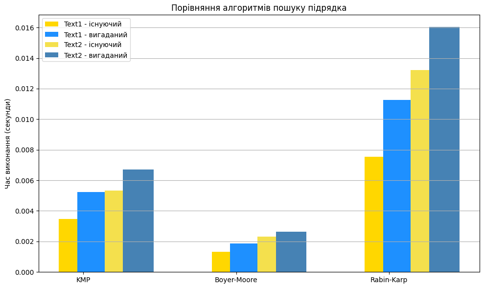

# Порівняння алгоритмів пошуку підрядка

Було протестовано три алгоритми пошуку підрядка:

- KMP (Кнута-Морріса-Пратта)
- Boyer-Moore
- Rabin-Karp

## Складність алгоритмів

| Алгоритм    | Теоретична складність | Найгірший випадок |
| ----------- | --------------------- | ----------------- |
| KMP         | O(n + m)              | O(n + m)          |
| Boyer-Moore | O(n / m)              | O(n \* m)         |
| Rabin-Karp  | O(n + m)              | O(n \* m)         |

---

## Результати експерименту

📄 Текст 1 (Жадібний / вигаданий)

| Алгоритм    | Час (існуючий) | Час (вигаданий) |
| ----------- | -------------- | --------------- |
| KMP         | 0.003461       | 0.005248        |
| Boyer-Moore | 0.001339       | 0.001865        |
| Rabin-Karp  | 0.007531       | 0.011269        |

---

📄 Текст 2 (Перевага / вигаданий)

| Алгоритм    | Час (існуючий) | Час (вигаданий) |
| ----------- | -------------- | --------------- |
| KMP         | 0.005324       | 0.006706        |
| Boyer-Moore | 0.002303       | 0.002638        |
| Rabin-Karp  | 0.013207       | 0.016025        |

---

## Візуалізація

---

## Висновки

Найефективніший алгоритм для обох текстів — **Boyer-Moore**.
Його стабільна перевага проявляється і для існуючих підрядків, і для вигаданих.
